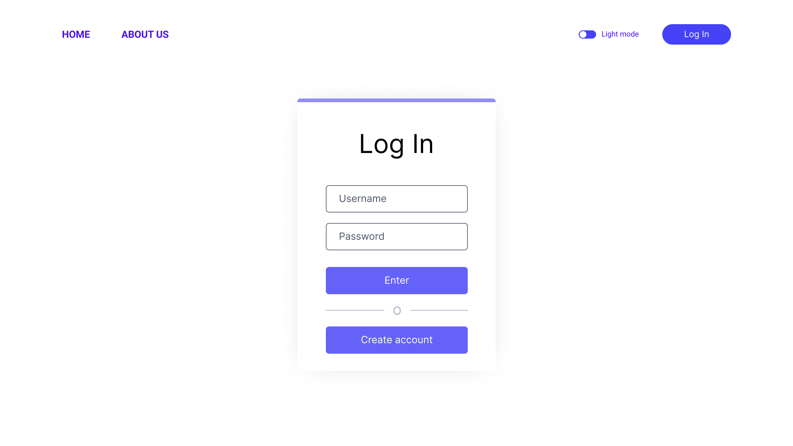
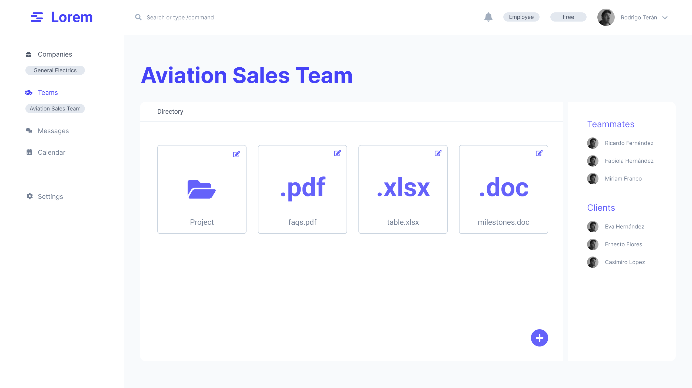
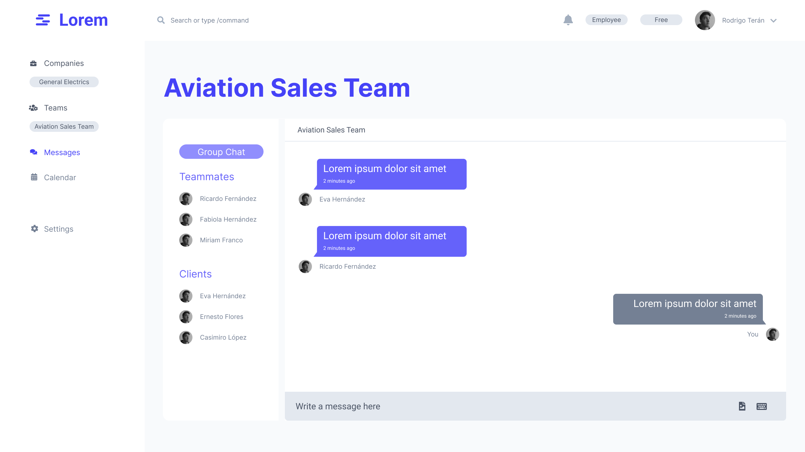

# Capstone-Project

## 1. Users Roles
- **Admin**: a user who pays to register his company on the website.
- **Employee**: a user who joins a company from an admin to work with their clients.
- **Client**: a user who joins the website to interact with the company´s teams.

## 2. User Personas
> Who are these users?
### Admin
- Entrepeneurs
- Team managers
- Freelancers

### Employee
- Employees
- Contingent workers

### Client
- Entrepeneurs
- Employees
- Contingent workers
- Freelancers
- Production supervisors

## 3. User stories
- As an **admin** I want to create a portal of my company, so that I can register all my employees.
- As an **admin** I want to join clients to the portal of my company, so that we can interact with each other.
- As an **admin** I want to group all my employees in different teams when needed, so that different teams can work with different clients.
- As an **admin** I want to join my clients easily, so that they don't waste too much time joining our portal.
- As an **employee** I want to share documents to our clients, so that we will not need to create multiple accounts of Drive providers.
- As an **employee** I want to schedule video meetings with our clients, so that we stay consistent with our communication.
- As an **employee** I want to communicate with our clients via chat, so that I don't need to register all the contacts in my phone.
- As an **employee** I want to create shortcuts in the app, so that I can work faster.
- As an **employee** I want to see a calendar with all our tasks, so that I don't miss anything.
- As an **employee** I want to have bots, so that if I miss to do something, they will remind me.
- As an **employee** I want to hide some information to our clients, so that we can share data only with other employees.
- As a **client** I want to log in to a company's portal, so that we can share everything that is business related.
- As a **client** I want to contact the company's work hours, so that I can schedule meetings in a better hour.

## Wireframes
[Link to Figma Designs](https://www.figma.com/file/1WdXW2DYnYd29OQK5lui80/Capstone?node-id=12%3A2)

### Some Pages

